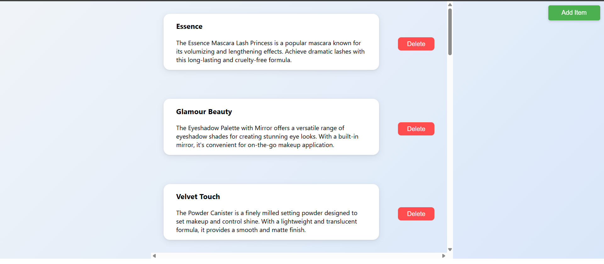
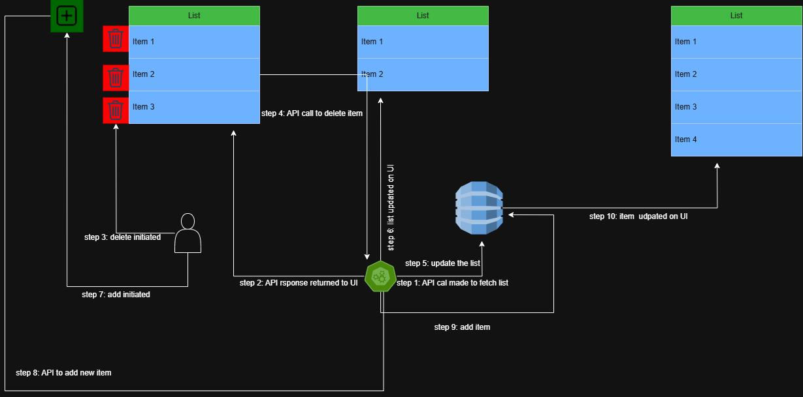

# This is the react project used for recruiter flow
## prereqs
```bash
# need node version > 18
# These pick up thhe right node version from .nvmrc
nvm install # just needed once
nvm use # needed everytime
```
## Local development
```bash
- `cd recruiter-flow-test`
- `npm install`
- `npm run build`
- `npm start
```
# Open [http://localhost:3000](http://localhost:3000) to view it in the browser.

see `package.json` script for more useful commands


The page will reload if you make edits.\
You will also see any lint errors in the console.

# output




# Flow diagram



# Project Folder Structure

- **src**
  - **apis**
  - **components**
      - **ListsItems**
    - **types**
